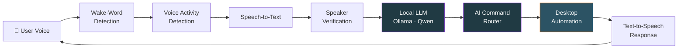
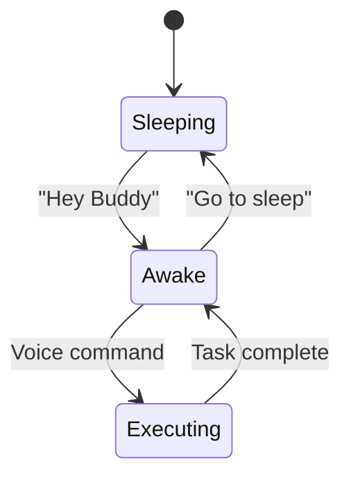
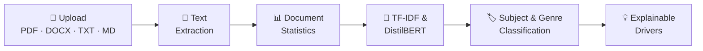
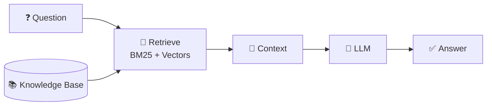

## My Profile

<picture>
  <source
    media="(prefers-color-scheme: dark)"
    srcset="https://raw.githubusercontent.com/Gkalyan2006/Gkalyan2006/output/github-snake-dark.svg">

  <source
    media="(prefers-color-scheme: light)"
    srcset="https://raw.githubusercontent.com/Gkalyan2006/Gkalyan2006/output/github-snake.svg">

  
</picture>

<!-- ANIMATED WAVE HEADER -->

  

<!-- TYPING ANIMATION -->

  

  
  
  
  

  
  

---

## 🚀 My Journey

I started my Computer Science journey by building a strong foundation in **programming, problem solving, databases, and web technologies**. Over time, my focus expanded toward **Artificial Intelligence, Machine Learning, Generative AI, automation, and intelligent software systems**.

```mermaid
flowchart LR
    A[💻 Programming<br/>Java · Python] --> B[🧩 DSA &<br/>Problem Solving]
    B --> C[🗄️ Databases<br/>SQL · DBMS]
    C --> D[🌐 Web Dev<br/>React · Flask]
    D --> E[🤖 Machine<br/>Learning · NLP]
    E --> F[✨ Generative AI<br/>LLMs · RAG · Agents]
    F --> G[🎙️ Jarvis<br/>AI Desktop Assistant]
    style A fill:#0f2027,color:#fff,stroke:#00d9ff
    style B fill:#0f2027,color:#fff,stroke:#00d9ff
    style C fill:#0f2027,color:#fff,stroke:#00d9ff
    style D fill:#0f2027,color:#fff,stroke:#00d9ff
    style E fill:#203a43,color:#fff,stroke:#8a2be2
    style F fill:#203a43,color:#fff,stroke:#8a2be2
    style G fill:#2c5364,color:#fff,stroke:#ff6f00
```

---

## 🛠️ Tech Stack

  

  

  
  
  
  
  
  

<b>💻 Programming & Problem Solving</b>

 

- ☕ Java & 🐍 Python programming
- 🧩 Arrays & Strings · 🔍 Searching & Sorting
- #️⃣ HashMap & HashSet · 🔄 LinkedHashMap & TreeMap
- 🔗 Two Pointer technique · 🧮 Frequency-based problems
- 🏆 Competitive programming · 💡 LeetCode problem solving

<b>🗄️ Database Management</b>

 

- **SQL:** DDL & DML, queries & subqueries, aggregate functions, NULL values, views, triggers, functions, embedded SQL, dynamic SQL
- **Theory:** Relational Algebra, ER Diagrams, Functional Dependencies, Armstrong's Axioms
- **Normalization:** 1NF · 2NF · 3NF · BCNF · 4NF · 5NF
- **Databases:** `Oracle` `MySQL` `SQLite`

<b>🌐 Web Development</b>

 

- HTML · CSS · JavaScript · React · REST APIs · Flask · Streamlit
- React forms, interactive interfaces, reusable frontend components
- User input handling, API integration, AI-powered web applications

<b>🧠 Machine Learning</b>

 

- Classification · Regression · KNN
- Feature engineering · Model evaluation
- TF-IDF · Text classification
- Anomaly detection · Explainable AI

<b>🤖 Generative AI (currently exploring)</b>

 

- Large Language Models · Local LLMs · Ollama
- Prompt Engineering · AI Agents · AI Automation
- RAG systems · Embeddings · Knowledge assistants

---

## 🤖 Featured Project: AI Desktop Assistant

  

### Overview

**Jarvis** is an AI-powered desktop assistant that allows users to interact with their computer through **voice and natural language**. The project began as a basic assistant concept and has evolved into a complete desktop automation system. It combines speech processing, a locally hosted large language model, and operating-system-level automation within a single, session-based workflow.

### Key Features

**1. Voice Interaction**
Jarvis supports hands-free operation through wake-word detection, speech-to-text transcription, and voice activity detection for accurate speech boundaries. Responses are delivered through text-to-speech, enabling continuous, natural conversation.

**2. Local AI Understanding**
Commands are interpreted by a locally hosted language model (Ollama with Qwen models). An AI-based routing layer maps natural-language requests to the appropriate action, so users can issue instructions in plain language rather than fixed command syntax. Running locally keeps processing private and independent of external services.

**3. Desktop Automation**
The assistant performs system-level tasks on the user's behalf, including file creation and management, folder operations, application discovery and launching, and command execution.

**4. Voice Authentication**
Speaker verification was explored using SpeechBrain with ECAPA speaker embeddings. The workflow includes voice enrollment and similarity-based verification to confirm the identity of the speaker before sensitive actions are performed.

### System Architecture

### Session-Based Interaction Model

Jarvis remains dormant until activated. Once awake, the user can issue multiple commands in a single session without repeating the wake phrase, and the session ends on request.

**Technology:** `Python` `Ollama` `Qwen` `SpeechBrain` `ECAPA` `Speech Recognition` `Text-to-Speech`

---

## 📄 AI Document Intelligence

A project focused on **document ingestion, classification, and explainable reasoning**.

- 📂 **Supported formats:** PDF · DOCX · TXT · Markdown
- 🔍 **Capabilities:** text extraction, document statistics, subject & genre classification, TF-IDF analysis, explainable classification with classification drivers, AI-assisted reasoning
- 🛠️ **Stack:** `Python` `NLP` `Scikit-learn` `TF-IDF` `DistilBERT` `Streamlit`

---

## 🧠 AI Knowledge Assistant & RAG

AI systems that answer questions from external knowledge sources using **Retrieval-Augmented Generation**.

- **Concepts:** document embeddings, semantic search, BM25, vector-based retrieval, knowledge bases, context retrieval, AI question answering
- **Stack:** `Python` `React` `TypeScript` `Vite` `Node.js` `Express` `Gemini` `Embeddings` `BM25`

---

## 🖼️ AI Image Analysis

Explored AI-based image detection and analysis systems: image processing, image classification, machine-learning based detection, model inference, and web-based AI interfaces.

---

## 🎯 Currently

- 🔭 Building and improving **Jarvis** with local LLMs
- 🌱 Deepening my knowledge of **RAG, embeddings, and AI agents**
- ⚡ Exploring **AI automation** workflows
- 🏆 Practicing DSA on **LeetCode**

---

## 🤝 Let's Connect

  
  

  <i>"Learning never stops. Every project is a step toward building smarter software."</i>

<!-- ANIMATED WAVE FOOTER -->

  

